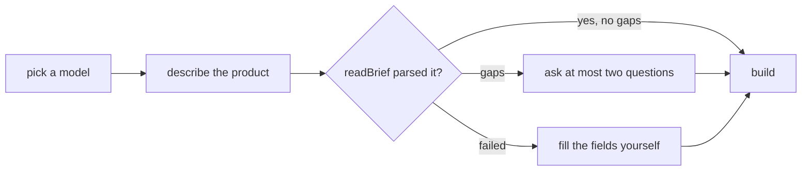
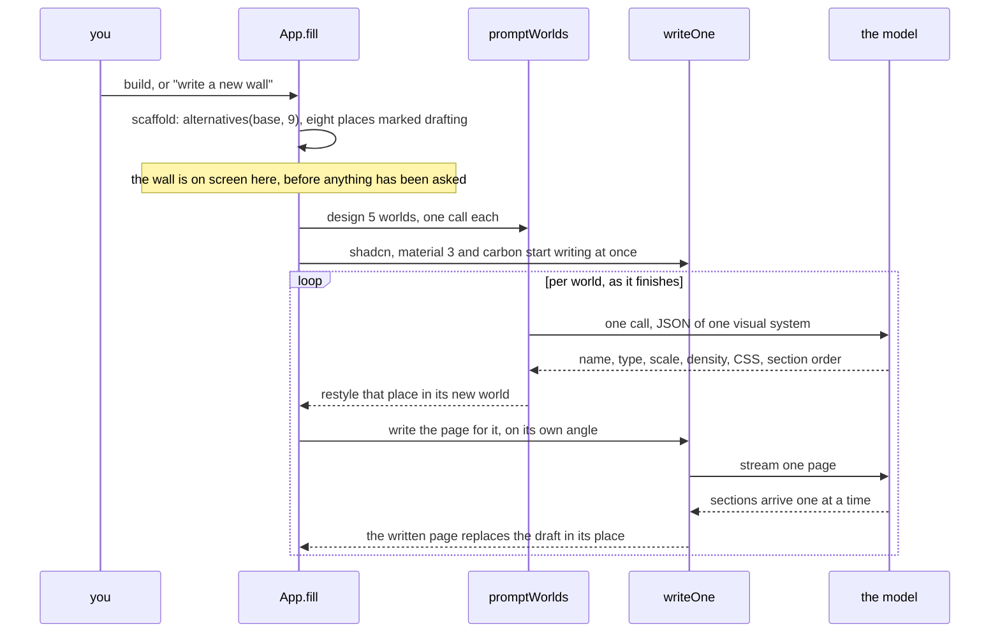
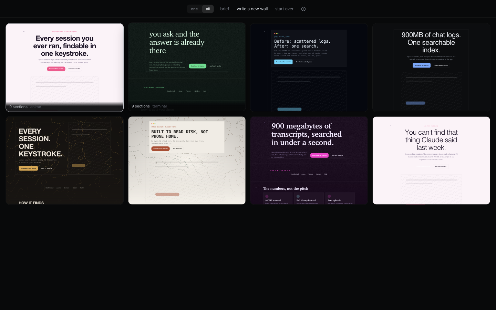
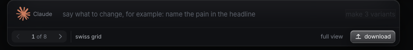
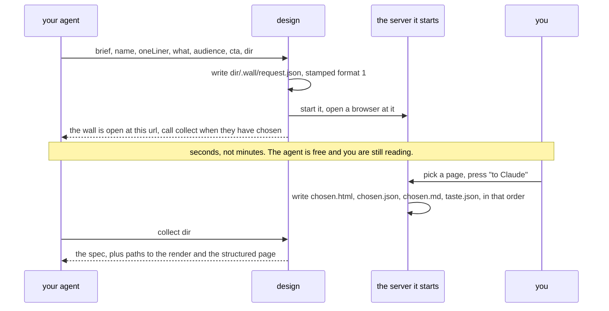

# Flows

Every path through Wall, from first run to a shipped file, with the code that carries it.
Written so someone who has never opened the app can follow what happens and where to change it.

The one act is compare and choose. Every flow below exists to serve that, so anything that
does not help you pick between pages is either absent or one keystroke away.

---

## 1. First run

Two steps, and the second one builds. Setup produces something rather than only explaining
itself, because an app that has already made eight pages is a better introduction than a tour.

| Step | What you do | Where it lives |
| --- | --- | --- |
| model | Pick from one row of marks. Claude, Claude Haiku, GPT, Gemini Flash, GLM, DeepSeek, Qwen, Kimi, MiniMax, or anything else that speaks the OpenAI shape. Paste a key, or leave it empty. | `src/Onboarding.tsx`, `src/models.tsx` |
| brief | Describe the product in a sentence or a paragraph. A model reads it into a structured brief and asks at most two questions about what it could not find. | `readBrief()` in `src/compose.ts` |



`localStorage['wall-onboarded']` marks it done. The help button in the header reopens the same
card in `explainOnly` mode, so the explanation is never lost.

Keys never leave the machine except as the authorization header of the call they belong to. Where
they rest depends on the shell: the desktop app puts them in the system keychain, which is
encrypted at rest and gated by the login session, a browser keeps them in `localStorage` under
`wall-key-<vendor>`, and a served deployment holds its own so none ever reaches the page. That is
flow 8.

---

## 2. Building a wall

The core flow. One click produces eight complete pages, each arguing a different case, each
built in a different visual world.

`fill()` in `src/App.tsx` runs it:



**The angles.** Eight positions a page can take on the same product, in `ANGLES`
(`src/compose.ts`): the pain, the outcome, proof first, plain and specific, the one line, for
the sceptic, the before, the craft. A wall is only worth scanning if the pages disagree, so
each angle argues a different reason to care rather than rephrasing the same one.

**The worlds.** A world is one set of decisions that propagate together: type pairing and
scale, tracking and weight, radius, density, whether sections carry hairline rules or numbers,
whether they sit in a column or bleed edge to edge, the measure in characters, how figures are
treated, which backdrop belongs to it, which form each role of the argument wears, the CSS it
brings, and which roles exist at all. `src/worlds.ts` holds six built in ones (swiss grid, editorial,
terminal, poster, catalogue, soft product); `promptWorlds()` asks the model for eight more,
designed for your product specifically.

A variant is an angle crossed with a world: what the page argues, and how it is built. That is
what makes eight pages read as eight designs rather than eight shuffles.

**Model authored worlds are clamped, not trusted.** `madeWorld()` bounds every number, since a
scale of 9 or a measure of 200 does not produce a daring page, it produces an unreadable one.
`safeCss()` strips imports and remote urls and caps the length, because a shipped page is one
file with no requests and model written CSS must not break that promise.

**The wall is up before the model is asked.** `scaffold()` arranges nine papers from the
built in worlds against the copy the brief already seeded: the page as it arrived, kept to
compare against, and eight places each holding a stand-in marked `drafting`. Every place is a
place a written page will land in, so the wall improves where it stands rather than appearing
all at once, and nothing on it is ever mistaken for finished. Three of the eight are named
systems, shadcn, material 3 and carbon, which cost nothing to design and so start writing at the
first frame; the model is asked for the other five.

**Streaming.** A page keeps one id for its whole stream, so `upsertPage()` replaces it in place
and a paper appears on its first finished section, then fills in. `scanSections()` walks a
partial reply tracking strings and brace depth, so a closing brace inside a headline does not
end an object early, and it resumes from a cursor rather than re-reading the buffer, because
copy full of braces would otherwise make one page quadratic work. The same walk recovers the
sections of a reply that was cut off, so a truncated page costs its tail rather than all of it.
Papers repaint per completed section rather than per delta, because a real stream delivers a few
characters at a time and repainting per delta would re-serialize eight pages hundreds of times
for the same content.

**Runs carry a token.** Writing a wall takes about half a minute and starting another must not
be blocked, so `run.current` is bumped per fan out and late pages from an abandoned run are
dropped rather than mixed into the new wall.

**Without a model** nothing above runs, and the wall says so rather than looking finished. The
scaffold is already up, the drafts stay marked, and the app flashes that these pages are arranged
rather than written, because eight arranged pages read as eight real ones until you read them.
`canUseCli()` is how it knows: the desktop can answer for itself, and a served page asks its
server, which is the only side that can see whether there is a claude on the machine. Layouts,
worlds, backdrops, editing and export never need a model at all.

**What one wall costs**, measured from real captures: about 14,000 input and 16,000 output
tokens, and around 28 seconds.

**The speed knob is which model designs.** Thinking is priced in seconds and the design calls do
most of it, so `WALL_DESIGN_MODEL=haiku` is the one setting that moves the whole wall: measured
on the same brief, haiku reached the first world in 10.7s against sonnet's 23.3 and finished all
eight in 45s against 74. Both returned eight valid worlds, and sonnet reached for the more
particular object, so this is offered rather than taken. `WALL_THINKING` sets the budget directly
for anything in between, and `WALL_FAST` turns it off entirely, which is for the iteration loop
rather than for a wall you mean to keep.

---

## 3. Comparing



Two views, switched in the header.

**one** is the studio. The paper you are on sits in the middle at full size; its neighbours sit
either side at 0.85 scale and 0.32 opacity. Move with the arrow keys, a horizontal wheel or
trackpad swipe, or by clicking a neighbour. Only five papers are mounted at a time, since the
rest cannot be seen and each one is a live iframe.

**all** is the grid: every paper at once, each labelled with its section count and taste name.
Click one to open it in the studio, and press escape to come back out, because reading one paper
is a detour from comparing eight.

The wall is eight papers and every one of them is designed. It used to open on a ninth, the page
as it arrived, kept as the thing to compare against: that made sense while the other eight were
arrangements of it, and became a fixed template sitting in front of eight designs once they were
each written whole.

The papers are real scrollable DOM in sandboxed iframes, not screenshots, which is the whole
claim: you are comparing pages, not pictures of pages.

**A finished page settles in.** Shipped pages, previews and the papers beside the centre carry
one orchestrated entrance: sections rise a few pixels in sequence, once, and then stillness,
with the pace set by the taste sheet's motion token and nothing at all under
`prefers-reduced-motion` or on a taste marked still. The editable paper in the middle never
animates, because it repaints per streamed section and per keystroke, and a page that settles
on every repaint reads as flicker.

**Narrowing is a keyboard pass.** `p` pins the paper in the middle and steps on, `x` takes an
unpinned paper off the wall, and `z` brings the last removed one back. A pinned page cannot be
removed until it is released, so one stray key cannot lose the page you meant to keep, and the
last page always stays, so the wall is never empty. In the grid every unpinned cell carries a
remove control and the survivors spread out, which turns eight pages into one by elimination
rather than by staring. Removed pages keep their ids refused, so a page still streaming in
cannot reappear after being turned away, and a page derived from a pinned one starts unpinned,
because the pin is a judgement about the paper you saw. The keys and the safety come from how
photographers cull: flag or reject with one hand, auto advance, and nothing is ever more than
one `z` from coming back.

**The triage is kept.** Pinning, culling, asking the bar for something and retyping a line on
the paper are the four judgements a session makes, and all four used to die in the browser. They
now travel twice: into the handoff as the reasoning behind this choice, and into a small file as
what you tend to keep. Section 7c is the file, and the paragraph on the cull story in 7b is what
goes to the agent.

---

## 4. Refining



Everything here acts on the paper in the middle, which is why the dock is one panel rather than
a toolbar per concern.

**The prompt bar makes variants, never edits in place.** One instruction produces three new
pages placed to the right, so you compare rather than overwrite. `runBar()` in `src/App.tsx`
calls `promptPage()` three times in parallel and jumps you to the first new one.

**The world is a control.** The name under the paper is the world it was built in; clicking it
rebuilds the page in the next one. Copy survives the change, because a section arguing a role
the new world also wants is reused rather than rewritten.

**The sections rail** lists every section by the role it argues, claim, proof, substance, the
offer, questions, the invitation, credits, and the form it is set in. Cycle its form, drag to
reorder, hide it, add a new role, fan its forms out into new pages beside this one, or draw its
image. Role and form are the two axes of the model: what a section argues and how it is set,
because conflating them is what made every generated page assemble from the same nine
marketing categories. A world maps roles to forms, so the same offer is a table in a catalogue,
one sentence on a poster, and a transcript line in a terminal, and two rules hold at dressing
time: adjacent sections never share a form, and a repeated role never repeats its form.

**Direct manipulation on the paper.** The editable render injects a small script that makes text
`contenteditable` and posts changes back over `postMessage`. `applyEdit()` writes the value into
the page model at `sectionId.a.0.b`, so the edit flows into the model rather than only into the
pixels. Sections can also be dragged on the paper itself.

**Taste follows a reference.** Drop a screenshot anywhere on the window and `tasteFromImage()`
reads the system out of it: background, ink, dim, two accents, contrast. It becomes the taste
sheet for every page on the wall. "More like this, less like a template" becomes a spec rather
than a wish.

---

## 4b. The design layer

Everything opinionated is data in `src/design/`, one file per kind of knowledge, so tuning
taste never touches machinery and machinery never hides taste:

| File | What it holds | Read by |
| --- | --- | --- |
| `design/faces.ts` | the face vocabulary: platform stacks and the two bundled variable faces | tastes, presets, worlds |
| `design/presets.ts` | the looks offered at setup | onboarding, the brief rail |
| `design/worlds.ts` | the six built-in worlds and the palette moves | `worlds.ts`, which dresses pages |
| `design/angles.ts` | the editorial positions a wall argues from | the fan-out |
| `design/craft.ts` | the writing standards that travel in every prompt | the prompts |
| `design/slop.ts` | the catalogue of tells, copy and markup, as data | the detector in `slop.ts` |
| `design/directions.ts` | fifty one grounded design directions, dealt blind to the brief and never more than half from memory, so a wall cannot converge | `compose.ts` |
| `design/prompts.ts` | the three system prompts: writing, world design, intake | `compose.ts`, which sends them |

The split rule for the slop catalogue: a tell that is a pattern lives in the data file; a
tell that has to count or compare lives as code in the detector, because a counting
mini-language would be harder to read than the count. Add a tell, add a world, add an angle,
sharpen a prompt: each is one edit in one file, and the gate in `verify/app.mjs` re-judges the
house on the next run.

---

## 4c. Two halves of a wall: arranged and written

Five of the eight papers are **arranged**. A world picks values, the renderer assembles blocks, and
the model chooses between forms this repo enumerated: eight roles, twelve blocks, about fifteen
knobs. That is a box rather than a space, which `worlds.ts` admits to in its own opening paragraph,
and it is why the pages have a ceiling no prompt can lift.

Three are **written**. `writeWhole()` in `src/compose.ts` hands the model the tokens, the faces and
one direction and asks for the document: markup and styles, in one call rather than a design call
plus a copy call, because there is no machinery for the two halves to land in separately and
because it is the only way the type can answer to the layout.

Both halves land on the same wall wearing the same look and the same embedded faces, which is what
makes this an experiment with a control rather than a demonstration. Which approach is better is
the question a wall exists to answer, so it is answered by culling rather than by argument.

**The deck is dealt blind to the brief, and that is the engine.** A call handed a seed packet and
a call handed a fire exit plan cannot converge. Tagging the fifty one objects by industry would
hand every finance page a ledger forever and trade the best output for the safest, so it is not
done. The cost is the rare pairing that is untrue rather than surprising, and for that alone a
design call may refuse its ground: grief, health, safety, money and law are where an unexpected
register stops being daring. The hatch is deliberately too narrow to be comfortable, because a
model given room to find a ground unsuitable will find the safe version of the category next, and
that is the failure the whole deck exists to prevent. A call that refuses names what it built from
instead, and that is what reaches the memory, or the log would favour a ground no page here was
ever built from.

**Both halves are asked to draw.** Every design prompt used to say "use CSS" and mean treatment: a
dashed rule, a slab of colour, a hairline. None of them asked for the subject itself. On the first
real wall a model did it unprompted, drawing a record with grooves and a numbered "500 only" stamp
for a vinyl reissue, and that was the paper worth looking at, which said the instruction was
missing rather than the ability. Both calls now carry the same one: draw the object your ground
already names, at a size somebody notices, because a page that draws its own subject could not be
any other page. A world's CSS budget went from four thousand characters to nine thousand, since a
disc with grooves does not fit in a budget set for a dashed rule, and a written page picks the
backdrop behind it rather than inheriting whatever the place on the wall was wearing.

The three seeded built-in worlds do not respond to any of this: their CSS is written by hand in
`design/worlds.ts`. So a prompt change reaches five of the eight papers, and the other three are a
taste decision in a data file.

**Nothing about a written page is true by construction, so all of it is proved.** `src/written.ts`
filters the markup to an allowlist of tags and attributes, because a denylist is a list of the
attacks somebody thought of. Two things make that load bearing rather than tidy: a shipped page is
one file that makes no requests, and the frame a paper renders in carries `allow-scripts` with
`allow-same-origin`, which together are not a sandbox, so a surviving script would run against this
app's origin where the keys are. Links may point anywhere a reader might click; sources may only be
a data url, because the same address is a link in one and a tracking pixel in the other.

A reply with no `<h1>` is refused, since that is the one structural claim worth making about a
document nobody arranged. **A refusal is not a hole in the wall**: the place falls back to an
arranged page, because eight papers beats seven and a gap.

The detector reads a written page's markup rather than its sections. A written page keeps sections
so the brief and the handoff have something to describe, and those still hold the defaults nobody
rewrote, so reading them judged the page on copy the reader could not see. The gap that remains is
that the tells scoped to a field, a witness, a call to action, a logo row, name a slot the arranged
model has and a written page does not.

---

## 5. Slop detection

`src/slop.ts` names the patterns a model reaches for when it has nothing specific to say:
hollow words, generic calls to action, vague headlines, hero eyebrow chips, ai beige,
glassmorphism, default drop shadows, italic serif display, nested cards, card soup.

It runs locally against the page model and the rendered HTML, because several of the patterns
are visual rather than textual. Being local and instant is what lets it run **before** the model
call, where its findings are passed into the prompt as things to avoid. A checker that only runs
afterwards is a report; one that runs first is a constraint.

The same catalogue covers the tells of generated writing, not only generated decoration: the
"not X, it is Y" pivot, "whether you are A or B", the headline that asks a question the page
answers, stock filler phrases, chained em dashes, rows of bare statistics, placeholder company
logos, the coloured left border, glowing text. `src/craft.ts` carries the inverse of each into
the system prompt, so the writing is shaped before there is anything to detect.

**It only ever asked half the question.** The catalogue answers whether a design is generic and
subtracts. Nothing asked whether it is anything at all, so a world could pass every check by being
careful: a column, nothing leaving it, a scale in the middle of the range, no art behind it and
ten lines of CSS. Clean and undesigned are different states and only one of them was measurable.
`unspent()` in `src/worlds.ts` is the other half, counting five moves a world can make and calling
it timid if it made fewer than two of them, and a timid world goes back through the same repair a
flawed one does. It counts decisions rather than volume, because the opposite of timid is not
loud: a gallery card with enormous margins, one hairline and nothing else has committed twice
over. `verify/app.mjs` holds the house to it, and asserts that the restrained world still passes,
because without that this becomes a demand to be loud and a wall of eight loud pages is one note.

**It reads the whole page.** The copy half used to walk a section's top level strings and drop
everything that was not one, so every list, table and group was invisible to it: on the default
page that is 58 of 84 strings and 57% of the characters. The headline and the sub were policed
and the substance items, the pricing plans, the objection answers and the footer were not, which
is the half of a page that actually fills up with filler. One tell in the catalogue could never
fire at all, because the only place company names live is an array. A leaf now keeps the key
nearest to it, so a plan's name is still a `name` and the key scoped tells go on meaning what
they meant.

**What it finds in copy is now repaired, not only reported.** A world that trips the detector has
always gone back to the model with its faults named and been kept only if it improved. Copy that
tripped it got a chip and shipped: a recorded wall handed back a testimonial signed "A real
person" at "founder, somewhere", which is this app's own placeholder for a page with no customer
yet, left untouched because the writing call is given the page as it stands and rewrites what it
chooses to. `mendCopy()` in `src/compose.ts` closes that asymmetry. Only a page that failed pays
for it, it pays once, it lands after the page is already on the wall so nothing waits for it, and
the answer is kept only when it carries strictly fewer tells, because a rewrite that trades one
for another is a second opinion rather than a fix.

**The placeholders in the defaults are ones the detector can see.** A blank page has to put
something under a testimonial, and admitting there is no customer yet beats inventing one, so the
defaults are honest stand-ins: "A real person", "founder, somewhere", "Replace these with real
names". The danger is the other end, so each has a tell of its own and `verify/app.mjs` fails if
any of them stops firing. The house gate judges those same pages on the design half only, for the
reason `flawsIn` gives: the copy there is placeholder on purpose and no world can fix it.

**The verdict travels with the paper.** The dock shows `clean` or `N generic` beside ship for
the page in the middle, with every reason in the tooltip, and the grid shows the same chip on
every cell. It sits with triage on purpose: the generic pages announce themselves while you are
deciding which cells to cull.

---

## 6. Images and backdrops

A landing page needs something behind the words. Wall draws it rather than generating a
photograph, for two reasons: a generated hero image is the fastest way to look like every other
page, and one image embedded as a data URI outweighs the entire document.

`src/backdrop.ts` has three, all seeded from the taste sheet so the art changes when the palette
does. `contours` and `ridge` are WebGL2 fields of topographic lines, `grain` is a still texture
drawn once. They honour `prefers-reduced-motion`, pause when the tab is hidden, fall back to a
gradient without WebGL2, and cost about 2KB inside the page. Each world brings its own.

Generated images are available where a section shows a figure, through Gemini, behind the same
host boundary as everything else. `illustrate()` returns a data URL that is stored in the page
content, so it still ships as one file. The prompt rules out text hardest of all, because words
baked into an image cannot be edited on the paper and are usually wrong.

**The image pipeline.** A generated image is the one thing in a Wall page measured in megabytes,
so it is the one thing worth compressing. Before the data URL reaches page content it goes
through `crates/wall-image`: decode, fit the long edge to 1400 because a page renders at 1280
wide and a figure is never all of it, flatten transparency onto the page background rather than
onto white, re-encode as JPEG at quality 82, and drop the metadata with the re-encode. On a
2400x1200 generated image that is **7.9MB down to 91KB, in 302ms**.

It is Rust compiled to wasm and inlined as base64, which means one implementation for the
desktop app, the web build and a served deployment, and no fetch for an asset in a shell that
loads its page over `file://`. It fails soft everywhere: an image that will not decode, a wasm
that will not instantiate, or a re-encode that came out larger all return the original, because
a slightly large picture is a better outcome than no picture.

Rust is here for this and not for the rest of the app. A whole wall of eight pages renders to
HTML in 0.18ms, which is a hundredth of a frame, so there is nothing else in the compute path
worth moving.

---

## 7. Shipping

`renderPage()` in `src/render.ts` turns the page model into standalone HTML: every token comes
from the taste sheet, the world's CSS is inlined, the backdrop is a couple of kilobytes of
inline script, and there is no framework and no runtime of ours.

- **full view** opens it in your browser. Desktop writes a temp file, the web build uses a Blob url.
- **download** writes it out. Desktop saves a real file and reports the path; the web build
  downloads it and reports the byte count.
The markdown spec still exists and is what the handoff writes, in `src/brief.ts`. There is no
longer a button that copies it: it lived in the brief rail, and that rail is gone along with the
section list's permanent column, because a wall of eight designs is not improved by two columns of
chrome standing beside it. If copying comes back it belongs on the dock beside download.

No accounts, no hosting of ours, no lock-in. The file is yours and it opens on its own.

---

## 7b. Handing back to the agent

The flow Wall exists for. You ask Claude Code for a landing page, it calls `design`, a wall opens
with your brief already in it, you pick one, and the choice comes back as a spec your agent
implements in your own codebase. Choosing happens where choosing is easy and building happens
where the code lives. `mcp/index.mjs` is the whole of it, in three tools: `design`, `collect`
and `check`.



**Returning without a choice is the normal answer, not an error.** `design` used to hold the call
for fifteen minutes, which is longer than any MCP client waits, so the usual outcome of a working
wall was a tool error, and an agent that reads an error tries again, which replaces the wall you
are halfway through reading. It now waits `WALL_WAIT_MS`, 25 seconds by default, in case the
choice is instant, and otherwise answers that the wall is open and that `collect` is the pickup.
The tool descriptions teach that two step, because they are the only place an agent can learn it.

**Everything the caller knows travels.** The agent has already read your project, so `design` asks
it for the one liner, the audience and the button label, and writes all of them into
`request.json`. When the one liner is there the app skips intake entirely, which is a model call
and about forty seconds. When it is not, the wall is arranged from the brief as it stands and put
on screen first, and the reading happens behind it under a line saying so.

**Every file carries a version.** `npx` keeps the writer current while whatever reads the
directory can be any age, so `request.json` is stamped `format: 1`, `chosen.json` is stamped
`format: 2` and `taste.json` is stamped `format: 1`, and each reader refuses a shape it does not
know rather than half reading it into a wrong answer.

**The cull story travels with the winner.** A page handed over on its own reads as though it
arrived on its own, and the next screen an agent writes drifts straight back into whatever was
culled. So `chosen.json` carries a `story` field, and `chosen.md` closes on a `## Why this one`
section written from it: what was pinned, what was turned away and what the detector read on it,
what was typed into the prompt bar and whether that page won, and which lines were retyped by
hand. The field is additive under the same `format: 2` on purpose. Bumping the number would make
every installed reader refuse the whole file to protect it from a field it can safely ignore.

**The order of the handoff is load bearing.** `chosen.md` is both the spec and the marker the
agent watches for, so it is written last of the three: the desktop shell takes a `BTreeMap` and
gets that for free, and the server sorts by name for the same reason. Finding it means the render
and the structured page are already there. `taste.json` sorts after it and that is fine, because
nothing polls for the memory: it is read at the start of the next wall, not at the end of this one.

**The server outlives the call and then stops on its own.** It holds API keys, so leaving it
running until logout is not acceptable, and killing it when `design` returns would close the
window mid-choice. So `WALL_IDLE_MS` is set to ten minutes by the spawner: any request resets the
clock, an open tab beats every twenty seconds by asking `/api/config`, and silence for that long
means the tab is gone and there is nobody left to serve. Unset means run forever, so `npm run
serve` and any deployment are untouched.

**Nothing to write with is said out loud.** After opening, `design` asks `/api/config` what the
machine holds, and if there is no key and no claude the reply says the eight pages are arranged
rather than written, so your agent can tell you before you spend time choosing between them.

`verify/mcp.mjs` drives this whole path over the real protocol, and `verify/oneline.mjs` drives
the first run version of it where nothing at all is installed.

---

## 7c. What the wall remembers

Every session labels design data and every session used to throw it away, so the tenth wall knew
exactly as much about you as the first. It now keeps a small file, and the next wall is dealt
with it in hand.

**The file.** `.wall/taste.json` in the project, beside the handoff, when an agent opened the
window. `localStorage['wall-taste']` when you opened it yourself. The two never merge, because a
taste belongs to the thing being designed and mixing a client's brand into a side project would
be worse than remembering nothing. It is stamped `format: 1`, and a shape this build does not
know reads as no memory at all.

**What is in it.** Up to twelve walls, newest last. Per wall: the date, the kind of thing it was
for, the pages kept with the chosen one first, the pages culled with the design tells they wore,
and what was typed into the bar. A page is written down as the handful of traits a preference
could be made of, the direction it grew from most of all, because a world's own name is whatever
the model called it that day and the direction is the stable thing. Nothing derived is stored.
Every signal is recomputed from the walls each time the file is read, which is what makes
deleting a line the way to forget a wall.

**Written at the choice, and only then.** Pressing "to Claude" writes it into the project;
pressing download writes it to the browser. A wall nobody chose from leaves nothing behind, and
choosing twice from one wall is still one wall, because a wall counted twice would weigh double
against every other wall in the file.

**How it biases the next wall.** `tasteLean()` reads the last eight walls of the same kind and
scores each direction: three for being chosen, two for surviving triage pinned, minus one for
being culled. Three things then happen, in `src/compose.ts`:

- the deal takes at most two of the five hands from what scored well, and never deals a direction
  scored down twice
- the design call for a favoured hand is told what your kept pages have in common; every hand,
  favoured or not, is told which tells you have removed pages for
- the copy call is told the same removals, after the detector's own note about the page in front
  of it

**At least three hands are always wild.** This is the whole risk of the feature and the guarantee
is structural rather than tuned. The failure mode of a system that learns your taste is that it
stops showing you anything else, and a wall of eight pages you already like is not a wall. So the
favoured count is capped at two, a dislike has to be repeated before anything stops being dealt,
the note about what you like never reaches a wild hand, and the log is capped at twelve so a
taste can move rather than only accumulate. `verify/app.mjs` deals twelve walls from a log biased
as hard as a log can be and fails if any deal takes more than two favoured hands, if a shunned
direction is dealt at all, or if fewer than ten of the twelve deals differ.

**Deleting a line is how you forget.** It is a small JSON file written to be read: open it, take
out the wall you regret, and the bias follows on the next build, because the scores were never
stored anywhere else. Deleting the file entirely starts you over.

---

## 8. One app, three shells

`src/host.ts` is the only file that knows where Wall is running. Everything above it is the same
code, so the web version is the desktop version rather than a reduced copy.

| Shell | State | Export | Model calls | Keys |
| --- | --- | --- | --- | --- |
| Tauri | a command to the Rust side | a real file on disk | the page, over a fetch that travels through Rust | the system keychain |
| Web | `localStorage` | Blob download | straight from the tab | your browser |
| Served | `localStorage` | Blob download | `/api/stream` on the server | the server only |

Which host answers is decided by what is present: Tauri injects `__TAURI_INTERNALS__`, a server
injects a flag into the page it serves, and neither means the visitor brings their own key.

**Why Tauri, and what it does not change.** Electron shipped a whole browser, so the download was
150 to 250MB; the Tauri build is a 5.9MB app and a 3.0MB dmg, which is 46 times smaller. Nothing
got faster: the wall is model latency, and the compute path was already a hundredth of a frame. It
is a distribution change, and it matters for the day the desktop app ships, because a 200MB
download is a decision and a 6MB one is not.

What ships today asks for neither. An agent run opens the browser, since `npx` needs no toolchain
and gives the operating system nothing to refuse to open, which is why Windows and Linux work
without a build and why a run is never stale.

The one thing it could have cost is the rule that `shared/providers.mjs` is the only model path.
A Rust main process would mean the request shapes, the SSE splitting and the delta extraction
written twice, and the second copy drifting. It does not, because only the transport moves:
`setFetch()` takes Tauri's fetch, which goes through Rust and so has no preflight to negotiate,
and every line above it is the same file the browser runs.

Two smaller differences are real and handled. The window drag handle is `-webkit-app-region` in
Chromium and a `data-tauri-drag-region` attribute in WebKit, so the header carries the attribute
under Tauri or the window cannot be moved by its own header. And what a command is allowed to do
is declared in `src-tauri/capabilities/default.json` rather than implied, which is why the model
endpoints are listed there.

`server/index.mjs` is one file with no dependencies. It serves the built `dist/` and holds the
keys, and `/api/config` tells the app which providers it already has, so the app stops asking for
a key it does not need. Two ceilings exist for public deployments, both off unless set, because
an instance paying with its own key does not need protecting from itself:

```
WALL_WALLS_PER_HOUR=5             # per address
WALL_DAILY_OUTPUT_TOKENS=500000   # whole deployment
WALL_IDLE_MS=600000               # stop after this much silence, unset means never
```

The unit is the wall rather than the request, because one click is eight calls. `WALL_IDLE_MS` is
for the copy an agent starts, which nothing else is in a position to end; a deployment leaves it
unset and runs until it is stopped.

`shared/providers.mjs` is the single model path for every shell: request shapes, SSE splitting,
and delta extraction for the Anthropic and OpenAI wire formats. Two shapes cover every vendor in
the picker.

---

## 8b. The motion studio

Everything above makes whole pages. This is the other half, and the same act: motion for a component
that already exists, several at once, compared side by side.

```
npm run studio                                            opens on examples/components
npm run studio -- ~/app/src/ui --css ~/app/src/globals.css
npm run studio -- --app http://localhost:3000             or just type the address once it is open
```

### Pointing it somewhere

The sidebar begins with an address bar. Type `localhost:3000` or `stripe.com`, press return, and that
page is proxied and pickable; the five most recent addresses stay in the rail with their own favicons
and survive a restart, because retyping the same host every morning is a tax a tool should not charge.
A bare host gets `https` unless it is this machine, since everything else redirects to it and the
redirect used to walk the browser out of the proxy.

Proxying rather than linking is the whole trick. An iframe on another port is another origin and its
dom is closed, so the dev server is served through the studio's own origin: routes under `/__wall` so
an app with its own `/api` cannot collide, everything else forwarded, the websocket upgrade passed
through so hot reload survives, and stylesheets named by absolute url pulled back onto this origin so
they can be read. Two sites defend themselves and are handled rather than hidden: one that navigates
its own frame back to its canonical host is reloaded with scripts refused, since the picker wants the
rendered dom and not their javascript, and one behind a bot check is reported as unreachable because a
proxy cannot pass one.

Reading a component out of a `.tsx` is a brace counter and a hope. A rendered dom is the answer, which
is why pointing at something running beats pointing at a file.

### Picking from a page that cannot be proxied

Proxying puts somebody's application on the studio's origin, which is the whole trick and is also
something the application notices. One that signs in against its own api on another host is making a
cross origin request the moment it runs here: that api allows its own site and not localhost, so the
call is refused, the app never authenticates, and it sits on its loading shell. Measured on a real
one, three hundred and eighty nodes and nothing to read. Nothing can be fixed from this side, since
the session belongs to a domain the studio is not.

So the picker goes to the page instead. It is the same picker, kept in a bookmark, and where a
capture goes is the only thing that changes: framed by the studio it posts to the parent as it always
has, and run on the page itself it copies to the clipboard. That is the one road out a content
security policy does not govern, and a site strict enough to need this sends `connect-src 'self'` and
`script-src 'self'`, which forbids both fetching the studio and loading the picker from it. The whole
picker travels in the url for that reason: twenty kilobytes of bookmark is inelegant and is the only
shape that works.

Everything picked in a visit is copied together, so four elements are four clicks and one paste. The
studio takes a paste anywhere rather than into a field, because there is nothing to focus and asking
for a click first is a step that exists only to make the code simpler. Anything else on the clipboard
is left alone.

None of it needs the page to still be open, which is the property that makes this work at all: a
capture already carries the markup, the rules that matched it and a snapshot of how it looked.

### What a pick captures

Two captures, for two readers. The model gets the markup and the rules that actually matched it, so a
selector written against real class names still means something after somebody edits the component.
The preview gets a snapshot: a clone with every computed value written onto it, which needs no
collected rules and cannot be let down by one that was missed. Measured across four sites, a heading
that laid out at 31 percent of its height came back at 100, a button at 57 came back at 100, and
nothing got worse.

The picker stays armed until Escape, since a rail is built from several picks and disarming after each
one made the second click look broken. Each pick reports its own size and node count, and says when it
is a poor subject: a strip too thin to stagger, an element with nothing inside it, an svg cut short,
or most of the page rather than a component.

### Asking

`dealMotions` and `dealErrands` deal each option a different manner and a different job, which is
forty eight combinations from sixteen lines and the reason five options disagree rather than being
five takes on a fade. The errand matters as much as the verb: revealing something is an entrance, but
singling one part out means the rest holds still, and keeping something alive means nothing arrives at
all. Errands that are about one thing say so, and the stagger requirement is lifted for them.

### What judges it

Six gates read the sheet and a seventh renders it.

- `safeStyle` bounds what a sheet may contain at all.
- `unmoved` rejects a transition wearing a costume: no keyframes, or no stagger where the errand
  implies parts arriving.
- `brittle` rejects selectors pinned to utility classes, which stop matching the first time somebody
  changes a spacing.
- `janky` rejects keyframes that animate layout properties, because every one of them has a transform
  spelling that looks identical and costs nothing.
- `unstill` requires a reduced motion query.
- `leaks` rejects a selector that does not start from the scope attribute, because `.card {}` looks
  right in a preview where the only card on screen is the one being previewed and then animates every
  card in the host application.
- The seventh renders the option twice, once held past the end of its motion and once without the
  motion at all, and compares every element's box and opacity. A sheet can satisfy every reading of
  the text and still leave the component twelve pixels down for good, or invisible, or animating
  nothing whatever. Both of those were built and confirmed to pass all six before this was written.

`namespaced` fixes rather than complains: every keyframe is renamed to carry the scope, because
`@keyframes` is one flat namespace shared by every stylesheet on a page and a sheet defining `rise`
replaces whatever the host already called `rise`.

Everything here was calibrated against real output before it was enforced. Over 23 options every one
already respected reduced motion, so requiring it costs nothing; only 70 percent landed inside the
timings the prompt asks for and the tail was the errands that are supposed to be slow, so `tempo`
reports and does not enforce. Unscoped selectors turned up about once in thirty, which is what makes
them safe to reject.

### Choosing

Legality has a floor and no ceiling, so the rendered pass also measures three things it does not
reject on: how much of the component takes part, how far anything strays outside its own box, and how
much is invisible at the very first frame. Options are ordered by the last two, because a component
that cannot be seen when you first look at it is worse than one that can. How much takes part is shown
and deliberately not scored, since an emphasis motion stirs three percent and an entrance stirs ninety
and neither is better.

Two of those measurements were wrong before they were right, and calibration caught both. Bounding box
displacement reported that fifteen of twenty one motions barely moved, including rows typing onto a
page, because a clip-path reveal and a scaleX move no box. And sampling only real elements reported
that nothing took part in a border tracing its own outline, because that is a pseudo element.

`Open` fills the room with one option, since a card three hundred pixels wide is a thumbnail of a
decision rather than the decision. `More like this` keeps the one that nearly worked and varies how it
is carried out. The inspector adjusts a chosen option without asking again: slower, further apart,
landing harder are all arithmetic on numbers already in the sheet, so `retimed` rewrites them and the
original stays beside it.

### Several elements, and the camera

Picks accumulate into a rail: one motion each, played on one timeline. The sequencing costs nothing
because the transport already exists, so each element is held at `t` minus its own offset rather than
having its delays rewritten.

A rail is a composition, and it was being shown as a stack of boxes with the order encoded in an
invisible constant: every car started 420ms after the one above it, and nothing said so or let you
change it. The one thing a rail is for, deciding what happens when, was the one thing you could not
see or touch. So the sequence is drawn under it, a bar per car placed where it starts and as long as
it runs, and dragging a bar moves that car in time. The frame reloads when the drag ends rather than
on every pixel, and the scrubber resizes to whatever the new arrangement needs. A rail can be exported
too, which it could not before.

The camera is four shots on that same clock: locked off, a slow push, a drift and an orbit, with a
lens dial that moves the defocus, the bloom and the vignette together. It used to be one twelve second
move set to infinite, and infinite was the fault: an animation with no end has an endTime of Infinity,
the transport filters that when sizing the scrubber, and dragging it end to end played an eighth of
the move. Every move is finite now and the ruler sizes itself to whichever runs longer.

Each row also carries its own camera. A camera is a perspective, a moving plate and two blurred
copies of the subject, and every one of those is per subject, so one shared rig could only ever film
the whole rail as a single flat picture. Each car with a shot gets its own rig, which is what lets one
sit locked off while the one below it pushes in.

Rows carry a grip and can be dragged into a different order. Order and offset are different
decisions, so reordering swaps places in the rail and leaves each car's own offset alone: two cars can
begin together and still need one above the other.

### An arrangement is a value

`cars` was a global that five handlers edited in place, and the timeline drew from a filtered copy of
it that shared its objects, so dragging a bar reached through a view and changed state nothing owned.
It also wrote positions in the filtered list into the markup and read them back as indices into the
real one, which agree exactly until a pick fails to move. An arrangement is a value now, in
`shared/arrange.mjs`, and every edit returns a new one: rows carry the index of the car they draw, and
undo stops copying, because the arrangement an edit replaced already is the snapshot. The motions
cars point at are frozen, which turns "nothing writes through a shared record" from an agreement
between call sites into a throw at the moment one breaks it.

That module is served to the page the way `raster.mjs` and `mp4.mjs` already are rather than written
into the template literal, so the arithmetic has one definition and node can check it without a
browser. It is served from beside the file rather than from the working directory, which is what the
other two were doing: they existed only when the studio was started from the repository root, so the
agent tool's studio could not load its own encoder.

### The timeline

Rows can be selected, shift for a range and the platform modifier to toggle, and dragging any
selected bar moves all of them, clamped as a group so the earliest meets zero with the shape intact
rather than the set piling up on the start. Bars snap to zero, to the playhead, to their neighbours'
edges, to markers and to a coarse grid, with alt to defeat it, read live so a magnet can be escaped
and then let go of to land clean. The threshold is seven pixels converted to milliseconds at the
ruler being dragged on, because a fixed millisecond figure is twenty two pixels of magnet on a short
rail and under two on a long one.

There was no playhead. The element was drawn and never written to while the comment above it claimed
it was the scrubber. It and the ruler now measure a real track instead of repeating a hand matched
270px that four column widths had to keep agreeing with. The drawn ruler is sticky and `fit` resets
it: sizing it to its contents meant the scale moved under the hand, and since the grid is chosen from
that scale, five presses of the same key moved a selection 100, 100, 250, 250 and 250ms.

Arrows nudge, cmd-A takes the rail, backspace removes and cmd-D duplicates. A held arrow repeats
thirty times a second, so a run collapses into one undo step.

### Choosing, which is what a rail was missing

`options` was asked for two motions per car, judged both, stored both, and handed back one. That made
the rail the single place in a tool about comparison where you could not compare, and it cost a field
on the response rather than a model call to fix. A row says which motion it is playing and how many
it has, lists them on hover, and cycles; the offset is left alone when it does, because swapping
alternatives is choosing a different performance of the same beat. `More like this` works per car
through the refine path, and the variations join that car's set rather than replacing what it plays.

The count stays at two. The command line provider allows eight sessions at once, so eight cars at two
goes each is already two waves rather than the one the code claimed, and a third would make it three.

### Cars tied to other cars

A car can follow another rather than the clock: drag from the end of its bar onto the row it should
follow, alt to start them together, drop it anywhere else to cut it loose. A ring is refused as it is
made and says which link already points the other way; the solver survives one either way, falling
back to the absolute offset every car still keeps, but a rail that quietly ignores what you asked is
worse than one that says no.

Two silent faults came out of building it. Dragging a tied bar wrote its absolute offset, which is
not what puts it anywhere, so the bar sprang back and the arrangement had changed underneath; a tie
is retimed by its gap now. And links were keyed by motion id, when a car's motion is the one thing
about it that changes: cycling onto an alternative renamed the car and cut loose everything following
it, which fell back to offsets it had been ignoring. The rail kept playing, at the wrong times,
having dropped a decision without a word. Cars have a key of their own now.

### Comparing arrangements

Fork what you have, change one thing, watch both at the same instant, keep one. This is the wall
applied to time rather than to layout. The transport needed nothing: `hold` already posts to every
visible frame with its index, which is how a grid of five options has always been driven.

Measured before the layout was settled. A rail of five cars is 30 animations a frame and 95 with a
camera on every one, because a rig clones its subject twice. One frame costs a median 8.3ms and a p95
of 8.4; two or three cost the same median and a p95 of 16.7, one dropped frame in twenty. The cost
arrives at the second frame rather than the third, so three is affordable and three is the cap. Film
refuses while several are on screen rather than filming whichever is on the left, which is the trap a
grid of five options already had.

Markers are dropped by double clicking a track and taken away by clicking them, and bars snap onto
them. The strip says what the composition does with its time: how many cars, when the last lands, and
where it goes quiet. That reports and does not judge, because whether a two second hole is a fault
depends on what the thing is for.

### Where each component sits

A rail opened as a stack of equal rows in the order the picks happened, which is not what any of
these compositions looks like: a header sits above a row of cards and a chart sits beside them. Every
component can be dragged to where it belongs and sized by the handle on its edge, and anything nobody
has touched keeps sharing what is left, so the stack is what it opens on and the stage is what a hand
makes. Places are kept in per cent, so an arrangement survives the frame being resized and a film at
1080 square shows what was arranged in whatever the window was. Where and when stay separate
decisions, the way order and offset already were.

The frame reports and does not decide. It is rebuilt from the arrangement on every change, so a
placement it kept to itself would be lost on the next render and would disagree with undo until then.

Each row also wears a picture of its element. The selection has drawn a thumbnail of every pick since
the picker existed and the rail never used one, so a row read `div.something` when it could show the
thing. Naming was its own fault: the label was cut at the first dot, and nearly everything on a page
is a `div`, so two picks read identically and the row was named after its motion rather than after
what the motion moves.

### Restarting under an open page

`npm run studio` watches its own sources, so an edit bounces the process in about half a second while
the tab carries on with the javascript it loaded. A dynamic import is cached for the life of a
document, so a change to `arrange.mjs` or `raster.mjs` is not in that tab at all and the studio and
the page it served disagree with nothing saying so. That is how a fix can land, be checked, and still
not be what somebody is looking at, which is the stale process warning one process along.

The page reloads when the boot answering it changes, which is only bearable because the work is left
with the server first: the picks, the arrangement, every offset, link and placement come back with
it. The options survived a restart and the composition did not, which was the wrong way round. The
blob is opaque on the server, because the page is the only thing that knows what an arrangement
means, and it is revived rather than trusted on the way back, since everything here leans on the
motions being frozen and json carries values and not that promise.

### From a rail to an editor

A car was an element with exactly one motion welded to it. The bar's position was when that motion
started and the bar's length was the motion's own span, which nothing could change. That is a
comparison instrument that grew a timeline, and it cannot say the thing a product demo is made of:
this element appears here, does something there, moves aside, and leaves.

Four changes turn it into one, and each is separately useful.

**A component has a life.** When it comes on and when it goes, drawn behind its motion on the same
row and draggable at either end. Both defaults are derived rather than stored: it arrives when its
motion starts, because that is what putting the motion there meant, and it stays unless told
otherwise. Writing either into every car at birth would freeze a decision nobody made and go stale
the moment the motion moved. This is also what made a rail look like nothing was happening, since
every car was in the document from the first frame and a light component showed its own white box
for the whole composition while only its contents staggered in.

**A bar can be trimmed.** Dragging its end retimes the motion through the same `retimed` the
inspector uses, so the idea is kept and only the clock changes, and the gates still run on the
result. A retime replaces the retime before it rather than being appended, or a row's alternatives
become a record of every drag instead of the set of real choices they exist to be.

**A component can be sent somewhere.** Alt drag it on the stage and it travels there, arriving at
wherever the clock is. Where it sits and where it goes are different decisions, so a plain drag still
places it. Each journey renders as one keyframe track spanning the whole composition rather than one
animation per leg, because several animations on one element fight: a later one held before its own
start still applies its first frame and overrides whatever the leg before it finished at, so a
component that moved twice would snap back in between. The track's delay is minus the car's own
offset, which is what puts a journey written in composition time back onto the car's own clock.

**The stage is part of the editor.** Clicking a component selects its row and the row lights the
component, because a selection that is only true in one of the two places somebody is looking is not
a selection. And the playhead can be put where you want it by clicking the strip, since an editor's
whole interaction is to put the clock where something should happen and then do the thing. That
needed a life to become a backdrop rather than a target: a car that never leaves has one the width
of the whole track, and while it was clickable there was nowhere left to put the playhead.

**And the camera is one of those journeys applied to everything at once.** Alt drag the stage itself
rather than a component and the whole picture travels, which is the same gesture one level up. The
four presets and the rig per car stay, because a rig per car is what lets one component sit still
while the one below it pushes in, and that is a different question from where the whole picture
goes. One reader and one track builder serve both, so a camera cannot drift away from a journey in
how it composes or how it is filmed.

Still to do here: a bezier editor, since four easing presets is a ceiling on taste.

### Handing it over

`Export` writes one html file with every option in it, the transport included, no requests at all.
The options share a document rather than sitting in iframes, which they can only do because each sheet
is already scoped: option two gets `data-motion-fold-2` and its selectors are rewritten to match.

Two different artifacts come out of that one button and they were being written as one. Several
motions for a single component is a comparison, so it is a grid of captioned cards held at the same
instant, which is the whole point of looking at them together. A rail is a composition, so it is one
stage with the cars in the order they were arranged and each held at `t` minus its own offset. Until
this was split, a rail exported as the first of those: every component starting together, in a stack,
with the sequencing gone. Nothing in the file looked wrong, because every id was there and every
sheet was correct, and the one decision a rail records was simply not written down. The offsets now
travel with the ids, and the exported transport finds which car an animation belongs to the same way
the rail frame does, by walking up to the nearest `data-rail`.

Three things had to be added to that one at a time, and the order is the lesson. The offsets went
first. Then the placement, once components could be put where they belong, because sending the ids
and the offsets alone lost the layout exactly the way sending the ids alone had lost the timing. Then
the cameras, which arrived locked off. Every time the file looked complete: every id present, every
sheet correct, one decision quietly not written down. The status line now names what actually
travelled rather than saying the file was written and leaving you to find out.

`railView` had the same fault a step further in. It drops ids the store has evicted and then read the
offsets and cameras at the position each car ended up in rather than the one it was asked for, so a
single missing option handed every car after it its neighbour's timing.

`Film` renders whatever is on screen frame by frame, the rail with its offsets and cameras included,
and plays the result in a panel with somewhere to take it away, because a path printed in a status
line is a thing you then have to go and find.

That sentence was false for as long as it had been written. The transport holds each car at `t` minus
its own offset, which is an operation on live animations, and filming does not watch a document, it
copies one: a copy carries declarations and not clocks, so `holdAt` writes the instant into each
element's own `animation-delay`. It wrote one instant into all of them, so a filmed rail came out with
every car starting together, the same loss the export had and for the same underlying reason. A
document with more than one clock in it now says so in the markup, `data-wall-at` on each car, and
`holdAt` reads the nearest one rather than assuming there is only the document's. A car whose turn has
not come sits at a negative instant, which is what leaves it holding its first frame instead of being
dragged forward to it. It hands back an mp4 if ffmpeg is on the machine and the frames plus a one line script if it is not. Stepped
rather than recorded: a recording hopes the machine keeps up and produces a different file every run,
while setting the clock by hand produces the same film every time. Measured on a real option, 48
frames at 1280 by 720 in under a second.

It draws in the browser rather than on the machine serving the page. There were two of these and a
setting to choose between them, which was the wrong answer: the headless one rendered exactly what
chromium renders, but it needed playwright and ffmpeg, and playwright is a development dependency
absent from the published package while ffmpeg is something a person may happen to have. On a clean
install it produced no film at all, and a path that is not installed is not more faithful than one
that is. What the browser path cannot draw is specific and short, so `limits()` looks for those five
things in the document being filmed and says so on the film where they are present.

### Proving it

```
node verify/studio-sites.mjs            twenty real sites: reachable, readable, pickable
node verify/studio-capture.mjs --deep   what survives being picked, by kind of element
node verify/studio-capture.mjs --rail   the composition, with no site and no key
```

The rail leg is in the capture suite rather than in one of its own, and it skips the site loop, so it
needs neither the network nor a model. The composition's arithmetic is a pure module, and the export
is checked by seeding the studio's own session store with three motions and then opening the file it
writes: the failure worth catching there is a silent one, since a rail with its offsets dropped still
plays and still looks like a composition somebody chose. That is why it is the one studio leg inside
`verify:all`, which is the command people actually run.

The other two need the network and both are worth the minutes, because every proxy bug so far was
invisible to a fixture. Nineteen of twenty sites work end to end; npm sits behind a bot check. Capture keeps tree
and shape for 67 of 89 elements, and svg is the weakest kind at 5 of 11, which is the next thing to
chase.

It opens on port 4321, and a port already answering steps to the next free one and says so, because
two studios at once is a reasonable pair to want. `PORT=0` still means whatever is free, which the
suites rely on. Kill by port rather than by name when scripting against it.

---

## 9. Development flows

```
npm run web            # the Vite dev server, what an agent run opens
npm run app            # the desktop shell, not released yet
npm run app:bundle     # a real .app and dmg, for when it is
npm run serve          # the built app behind the server, with its own keys
npm run try            # what an agent run does, without needing an agent: brief, server, browser
npm run watch          # rebuild dist on every change, so try and the suites are never stale
npm run wallclock      # how long a whole wall takes, measured through the real app
npm run studio         # motion for components you have, or for an app that is running
npm run build:wasm     # rebuild the image crate and inline it, needs Rust
```

`npm run build` already builds the headless core, since `dist-core/core.js` is what the `check`
tool imports and a stale one would answer for a detector nobody is running.

Only `build:wasm` needs the Rust toolchain, and only someone changing `crates/wall-image` needs
to run it, because its output is committed. A fresh clone builds, runs and verifies without Rust
installed. Building the desktop app needs Rust; building and verifying the web app does not.

### Verifying

In order of how much they prove:

```
npm run verify         # the app in a real browser against a mock model, and the house gate
npm run verify:server  # the real server against a recorded upstream, asserting the visitor holds no key
npm run verify:stream  # the real streaming path, no mock anywhere
npm run verify:hard    # copy that fights back: markup, braces, other scripts, other alphabets
npm run verify:beat    # the thinking beat, and that none of it reaches the reply
npm run verify:cli     # what a failed local session says it failed for
npm run verify:image   # the image pipeline, no browser and no Rust needed
npm run verify:tauri   # the desktop shell's own commands, in Rust, with no window
npm run verify:mcp     # the agent path over the real protocol, brief to spec
npm run verify:oneline # the same path on a machine with nothing installed
npm run verify:update  # what the published tarball carries, and how it is cached
npm run verify:all     # all of them
```

`npm run verify` is the house gate and runs `verify/layout.mjs` inside itself, which renders
every built in world on every look at three widths and fails if Wall's own output trips its own
slop catalogue. There is no separate command for it, because a geometry check nobody runs is a
geometry check nobody has. It also opens no browser for its first three sections: the house gate,
the escaping check, and the two node level checks on the taste log, one feeding it a hostile file
and one proving the deal stays wild under a log biased as hard as a log can be.

The two agent suites stand in for the local Claude with `verify/fakebin/claude`, which they put
on PATH along with a do-nothing `open`. Both are in the repository rather than in a temporary
directory, because a fixture a reboot can take away does not fail loudly when it goes: the suite
starts calling the real model instead, which is slow, costs money, and on a machine with no
session fails fast enough that a wall of unwritten drafts reads as a pass.

`verify:image` reads the committed wasm rather than the crate's build output, because that is
what ships, and builds its own input with zlib rather than loading a fixture, because a suite
with a binary to explain is a suite that rots. The input is low frequency colour with grain over
it rather than static: pure noise is the one thing JPEG cannot compress and no model produces, so
a suite built on it would measure the worst case and report it as the normal one.

`verify:stream` runs the app against a local server speaking Anthropic's wire format, so the
reader loop, SSE framing, split frames, fenced JSON, the partial JSON walk and the progressive
repaint are all exercised. It asserts that papers appear while the models are still writing,
that the wall never exceeds nine (which is the one id per stream upsert holding), that the eight
angles produce eight distinct headlines, and that a wall spans distinct worlds and distinct
looks. Eight pages quietly converging is a test failure rather than something noticed months
later.

Copy rules are asserted too: no all caps, no em dashes, no decorative symbols. A regression fails
the suite rather than shipping.

### Capturing a real run

```
WALL_KEY=$(cat ~/.wall-test-key) npm run capture
```

This drives the real app against the real API through a recording proxy and writes every byte of
every stream, with chunk timing, into `fixtures/`. `verify:stream` replays those captures at
their recorded pace, so the streaming path stays covered forever without a key and without
spending tokens. Pace is recorded because a replay that dumps everything at once would prove
nothing about whether papers visibly fill in.

The fixtures hold response bodies only. No request headers are recorded, so no key can end up in
them. Section ids are rewritten on replay to match the incoming request, since the app merges
replies by id, and with no fixtures present the server falls back to a synthetic stream so the
suite runs on a fresh clone.

### Screenshots

```
node tools/shots.mjs   # into shots/, which is not committed
```

`shots/` is generated output and stays out of the repo. The two images in `docs/images/` are
copies kept deliberately, and they go stale unless refreshed with the flow they illustrate.
