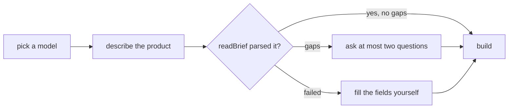
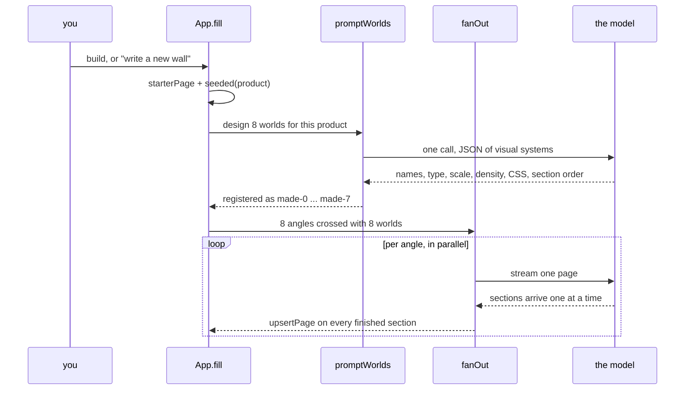

# Flows

Every path through Wall, from first run to a shipped file, with the code that carries it.
Written so someone who has never opened the app can follow what happens and where to change it.

The one act is compare and choose. Every flow below exists to serve that, so anything that
does not help you pick between pages is either absent or one keystroke away.

---

## 1. First run

Two steps, and the second one builds. Setup produces something rather than only explaining
itself, because an app that has already made eight pages is a better introduction than a tour.

| Step | What you do | Where it lives |
| --- | --- | --- |
| model | Pick from one row of marks. Claude, Claude Haiku, GPT, Gemini Flash, GLM, DeepSeek, Qwen, Kimi, MiniMax, or anything else that speaks the OpenAI shape. Paste a key, or leave it empty. | `src/Onboarding.tsx`, `src/models.tsx` |
| brief | Describe the product in a sentence or a paragraph. A model reads it into a structured brief and asks at most two questions about what it could not find. | `readBrief()` in `src/compose.ts` |



`localStorage['wall-onboarded']` marks it done. The help button in the header reopens the same
card in `explainOnly` mode, so the explanation is never lost.

Keys never leave the machine except as the authorization header of the call they belong to. Where
they rest depends on the shell: the desktop app puts them in the system keychain, which is
encrypted at rest and gated by the login session, a browser keeps them in `localStorage` under
`wall-key-<vendor>`, and a served deployment holds its own so none ever reaches the page. That is
flow 8.

---

## 2. Building a wall

The core flow. One click produces eight complete pages, each arguing a different case, each
built in a different visual world.

`fill()` in `src/App.tsx` runs it:



**The angles.** Eight positions a page can take on the same product, in `ANGLES`
(`src/compose.ts`): the pain, the outcome, proof first, plain and specific, the one line, for
the sceptic, the before, the craft. A wall is only worth scanning if the pages disagree, so
each angle argues a different reason to care rather than rephrasing the same one.

**The worlds.** A world is one set of decisions that propagate together: type pairing and
scale, tracking and weight, radius, density, whether sections carry hairline rules or numbers,
whether they sit in a column or bleed edge to edge, the measure in characters, how figures are
treated, which backdrop belongs to it, which form each role of the argument wears, the CSS it
brings, and which roles exist at all. `src/worlds.ts` holds six built in ones (swiss grid, editorial,
terminal, poster, catalogue, soft product); `promptWorlds()` asks the model for eight more,
designed for your product specifically.

A variant is an angle crossed with a world: what the page argues, and how it is built. That is
what makes eight pages read as eight designs rather than eight shuffles.

**Model authored worlds are clamped, not trusted.** `madeWorld()` bounds every number, since a
scale of 9 or a measure of 200 does not produce a daring page, it produces an unreadable one.
`safeCss()` strips imports and remote urls and caps the length, because a shipped page is one
file with no requests and model written CSS must not break that promise.

**Streaming.** A page keeps one id for its whole stream, so `upsertPage()` replaces it in place
and a paper appears on its first finished section, then fills in. `streamedSections()` walks a
partial reply tracking strings and brace depth, so a closing brace inside a headline does not
end an object early. Papers repaint per completed section rather than per delta, because a real
stream delivers a few characters at a time and repainting per delta would re-serialize eight
pages hundreds of times for the same content.

**Runs carry a token.** Writing a wall takes about half a minute and starting another must not
be blocked, so `run.current` is bumped per fan out and late pages from an abandoned run are
dropped rather than mixed into the new wall.

**Without a key** nothing above runs. `alternatives(base, 8)` arranges the same copy eight ways
locally, instantly, and the rest of the app behaves identically. Layouts, worlds, backdrops,
editing and export never need a key.

**What one wall costs**, measured from real captures: about 14,000 input and 16,000 output
tokens, and around 28 seconds.

---

## 3. Comparing


Two views, switched in the header.

**one** is the studio. The paper you are on sits in the middle at full size; its neighbours sit
either side at 0.85 scale and 0.32 opacity. Move with the arrow keys, a horizontal wheel or
trackpad swipe, or by clicking a neighbour. Only five papers are mounted at a time, since the
rest cannot be seen and each one is a live iframe.

**all** is the grid: every paper at once, each labelled with its section count and taste name.
Click one to open it in the studio.

The papers are real scrollable DOM in sandboxed iframes, not screenshots, which is the whole
claim: you are comparing pages, not pictures of pages.

**A finished page settles in.** Shipped pages, previews and the papers beside the centre carry
one orchestrated entrance: sections rise a few pixels in sequence, once, and then stillness,
with the pace set by the taste sheet's motion token and nothing at all under
`prefers-reduced-motion` or on a taste marked still. The editable paper in the middle never
animates, because it repaints per streamed section and per keystroke, and a page that settles
on every repaint reads as flicker.

**Narrowing is a keyboard pass.** `p` pins the paper in the middle and steps on, `x` takes an
unpinned paper off the wall, and `z` brings the last removed one back. A pinned page cannot be
removed until it is released, so one stray key cannot lose the page you meant to keep, and the
last page always stays, so the wall is never empty. In the grid every unpinned cell carries a
remove control and the survivors spread out, which turns eight pages into one by elimination
rather than by staring. Removed pages keep their ids refused, so a page still streaming in
cannot reappear after being turned away, and a page derived from a pinned one starts unpinned,
because the pin is a judgement about the paper you saw. The keys and the safety come from how
photographers cull: flag or reject with one hand, auto advance, and nothing is ever more than
one `z` from coming back.

---

## 4. Refining


Everything here acts on the paper in the middle, which is why the dock is one panel rather than
a toolbar per concern.

**The prompt bar makes variants, never edits in place.** One instruction produces three new
pages placed to the right, so you compare rather than overwrite. `runBar()` in `src/App.tsx`
calls `promptPage()` three times in parallel and jumps you to the first new one.

**The world is a control.** The name under the paper is the world it was built in; clicking it
rebuilds the page in the next one. Copy survives the change, because a section arguing a role
the new world also wants is reused rather than rewritten.

**The sections rail** lists every section by the role it argues, claim, proof, substance, the
offer, questions, the invitation, credits, and the form it is set in. Cycle its form, drag to
reorder, hide it, add a new role, fan its forms out into new pages beside this one, or draw its
image. Role and form are the two axes of the model: what a section argues and how it is set,
because conflating them is what made every generated page assemble from the same nine
marketing categories. A world maps roles to forms, so the same offer is a table in a catalogue,
one sentence on a poster, and a transcript line in a terminal, and two rules hold at dressing
time: adjacent sections never share a form, and a repeated role never repeats its form.

**Direct manipulation on the paper.** The editable render injects a small script that makes text
`contenteditable` and posts changes back over `postMessage`. `applyEdit()` writes the value into
the page model at `sectionId.a.0.b`, so the edit flows into the model rather than only into the
pixels. Sections can also be dragged on the paper itself.

**Taste follows a reference.** Drop a screenshot anywhere on the window and `tasteFromImage()`
reads the system out of it: background, ink, dim, two accents, contrast. It becomes the taste
sheet for every page on the wall. "More like this, less like a template" becomes a spec rather
than a wish.

---

## 4b. The design layer

Everything opinionated is data in `src/design/`, one file per kind of knowledge, so tuning
taste never touches machinery and machinery never hides taste:

| File | What it holds | Read by |
| --- | --- | --- |
| `design/faces.ts` | the face vocabulary: platform stacks and the two bundled variable faces | tastes, presets, worlds |
| `design/presets.ts` | the looks offered at setup | onboarding, the brief rail |
| `design/worlds.ts` | the six built-in worlds and the palette moves | `worlds.ts`, which dresses pages |
| `design/angles.ts` | the editorial positions a wall argues from | the fan-out |
| `design/craft.ts` | the writing standards that travel in every prompt | the prompts |
| `design/slop.ts` | the catalogue of tells, copy and markup, as data | the detector in `slop.ts` |
| `design/prompts.ts` | the three system prompts: writing, world design, intake | `compose.ts`, which sends them |

The split rule for the slop catalogue: a tell that is a pattern lives in the data file; a
tell that has to count or compare lives as code in the detector, because a counting
mini-language would be harder to read than the count. Add a tell, add a world, add an angle,
sharpen a prompt: each is one edit in one file, and the gate in `verify.mjs` re-judges the
house on the next run.

---

## 5. Slop detection

`src/slop.ts` names the patterns a model reaches for when it has nothing specific to say:
hollow words, generic calls to action, vague headlines, hero eyebrow chips, ai beige,
glassmorphism, default drop shadows, italic serif display, nested cards, card soup.

It runs locally against the page model and the rendered HTML, because several of the patterns
are visual rather than textual. Being local and instant is what lets it run **before** the model
call, where its findings are passed into the prompt as things to avoid. A checker that only runs
afterwards is a report; one that runs first is a constraint.

The same catalogue covers the tells of generated writing, not only generated decoration: the
"not X, it is Y" pivot, "whether you are A or B", the headline that asks a question the page
answers, stock filler phrases, chained em dashes, rows of bare statistics, placeholder company
logos, the coloured left border, glowing text. `src/craft.ts` carries the inverse of each into
the system prompt, so the writing is shaped before there is anything to detect.

**The verdict travels with the paper.** The dock shows `clean` or `N generic` beside ship for
the page in the middle, with every reason in the tooltip, and the grid shows the same chip on
every cell. It sits with triage on purpose: the generic pages announce themselves while you are
deciding which cells to cull.

---

## 6. Images and backdrops

A landing page needs something behind the words. Wall draws it rather than generating a
photograph, for two reasons: a generated hero image is the fastest way to look like every other
page, and one image embedded as a data URI outweighs the entire document.

`src/backdrop.ts` has three, all seeded from the taste sheet so the art changes when the palette
does. `contours` and `ridge` are WebGL2 fields of topographic lines, `grain` is a still texture
drawn once. They honour `prefers-reduced-motion`, pause when the tab is hidden, fall back to a
gradient without WebGL2, and cost about 2KB inside the page. Each world brings its own.

Generated images are available where a section shows a figure, through Gemini, behind the same
host boundary as everything else. `illustrate()` returns a data URL that is stored in the page
content, so it still ships as one file. The prompt rules out text hardest of all, because words
baked into an image cannot be edited on the paper and are usually wrong.

**The image pipeline.** A generated image is the one thing in a Wall page measured in megabytes,
so it is the one thing worth compressing. Before the data URL reaches page content it goes
through `crates/wall-image`: decode, fit the long edge to 1400 because a page renders at 1280
wide and a figure is never all of it, flatten transparency onto the page background rather than
onto white, re-encode as JPEG at quality 82, and drop the metadata with the re-encode. On a
2400x1200 generated image that is **7.9MB down to 91KB, in 302ms**.

It is Rust compiled to wasm and inlined as base64, which means one implementation for the
desktop app, the web build and a served deployment, and no fetch for an asset in a shell that
loads its page over `file://`. It fails soft everywhere: an image that will not decode, a wasm
that will not instantiate, or a re-encode that came out larger all return the original, because
a slightly large picture is a better outcome than no picture.

Rust is here for this and not for the rest of the app. A whole wall of eight pages renders to
HTML in 0.18ms, which is a hundredth of a frame, so there is nothing else in the compute path
worth moving.

---

## 7. Shipping

`renderPage()` in `src/render.ts` turns the page model into standalone HTML: every token comes
from the taste sheet, the world's CSS is inlined, the backdrop is a couple of kilobytes of
inline script, and there is no framework and no runtime of ours.

- **full view** opens it in your browser. Desktop writes a temp file, the web build uses a Blob url.
- **download** writes it out. Desktop saves a real file and reports the path; the web build
  downloads it and reports the byte count.
- **copy a brief** puts a markdown spec of the page on your clipboard, tokens once at the top
  rather than repeated under every section, ready to paste into Claude Code, v0, or a
  designer's inbox. `src/brief.ts`.

No accounts, no hosting of ours, no lock-in. The file is yours and it opens on its own.

---

## 8. One app, three shells

`src/host.ts` is the only file that knows where Wall is running. Everything above it is the same
code, so the web version is the desktop version rather than a reduced copy.

| Shell | State | Export | Model calls | Keys |
| --- | --- | --- | --- | --- |
| Tauri | a command to the Rust side | a real file on disk | the page, over a fetch that travels through Rust | the system keychain |
| Web | `localStorage` | Blob download | straight from the tab | your browser |
| Served | `localStorage` | Blob download | `/api/stream` on the server | the server only |

Which host answers is decided by what is present: Tauri injects `__TAURI_INTERNALS__`, a server
injects a flag into the page it serves, and neither means the visitor brings their own key.

**Why Tauri, and what it does not change.** Electron shipped a whole browser, so the download was
150 to 250MB; the Tauri build is a 5.9MB app and a 3.0MB dmg, which is 46 times smaller. Nothing
got faster: the wall is model latency, and the compute path was already a hundredth of a frame. It
is a distribution change, and it is worth it because the product's own pitch is a download.

The one thing it could have cost is the rule that `shared/providers.mjs` is the only model path.
A Rust main process would mean the request shapes, the SSE splitting and the delta extraction
written twice, and the second copy drifting. It does not, because only the transport moves:
`setFetch()` takes Tauri's fetch, which goes through Rust and so has no preflight to negotiate,
and every line above it is the same file the browser runs.

Two smaller differences are real and handled. The window drag handle is `-webkit-app-region` in
Chromium and a `data-tauri-drag-region` attribute in WebKit, so the header carries the attribute
under Tauri or the window cannot be moved by its own header. And what a command is allowed to do
is declared in `src-tauri/capabilities/default.json` rather than implied, which is why the model
endpoints are listed there.

`server/index.mjs` is one file with no dependencies. It serves the built `dist/` and holds the
keys, and `/api/config` tells the app which providers it already has, so the app stops asking for
a key it does not need. Two ceilings exist for public deployments, both off unless set, because
an instance paying with its own key does not need protecting from itself:

```
WALL_WALLS_PER_HOUR=5             # per address
WALL_DAILY_OUTPUT_TOKENS=500000   # whole deployment
```

The unit is the wall rather than the request, because one click is eight calls.

`shared/providers.mjs` is the single model path for every shell: request shapes, SSE splitting,
and delta extraction for the Anthropic and OpenAI wire formats. Two shapes cover every vendor in
the picker.

---

## 9. Development flows

```
npm run app            # the desktop app
npm run app:bundle     # a real .app and dmg
npm run web            # the Vite dev server
npm run serve          # the built app behind the server, with its own keys
npm run build:core     # the headless core, for a shell with no DOM
npm run build:wasm     # rebuild the image crate and inline it, needs Rust
```

Only `build:wasm` needs the Rust toolchain, and only someone changing `crates/wall-image` needs
to run it, because its output is committed. A fresh clone builds, runs and verifies without Rust
installed. Building the desktop app needs Rust; building and verifying the web app does not.

### Verifying

Three suites, in order of how much they prove:

```
npm run verify         # desktop, mock model
npm run verify:web     # the same assertions in plain Chromium
npm run verify:server  # the real server against a recorded upstream, asserting the visitor holds no key
npm run verify:stream  # the real streaming path, no mock anywhere
npm run verify:image   # the image pipeline, no browser and no Rust needed
npm run verify:all     # all of them
```

`verify:image` reads the committed wasm rather than the crate's build output, because that is
what ships, and builds its own input with zlib rather than loading a fixture, because a suite
with a binary to explain is a suite that rots. The input is low frequency colour with grain over
it rather than static: pure noise is the one thing JPEG cannot compress and no model produces, so
a suite built on it would measure the worst case and report it as the normal one.

`verify:stream` runs the app against a local server speaking Anthropic's wire format, so the
reader loop, SSE framing, split frames, fenced JSON, the partial JSON walk and the progressive
repaint are all exercised. It asserts that papers appear while the models are still writing,
that the wall never exceeds nine (which is the one id per stream upsert holding), that the eight
angles produce eight distinct headlines, and that a wall spans distinct worlds and distinct
looks. Eight pages quietly converging is a test failure rather than something noticed months
later.

Copy rules are asserted too: no all caps, no em dashes, no decorative symbols. A regression fails
the suite rather than shipping.

### Capturing a real run

```
WALL_KEY=$(cat ~/.wall-test-key) npm run capture
```

This drives the real app against the real API through a recording proxy and writes every byte of
every stream, with chunk timing, into `fixtures/`. `verify:stream` replays those captures at
their recorded pace, so the streaming path stays covered forever without a key and without
spending tokens. Pace is recorded because a replay that dumps everything at once would prove
nothing about whether papers visibly fill in.

The fixtures hold response bodies only. No request headers are recorded, so no key can end up in
them. Section ids are rewritten on replay to match the incoming request, since the app merges
replies by id, and with no fixtures present the server falls back to a synthetic stream so the
suite runs on a fresh clone.

### Screenshots

```
node shots.mjs         # into shots/, which is not committed
```

`shots/` is generated output and stays out of the repo. The two images in `docs/images/` are
copies kept deliberately, and they go stale unless refreshed with the flow they illustrate.
